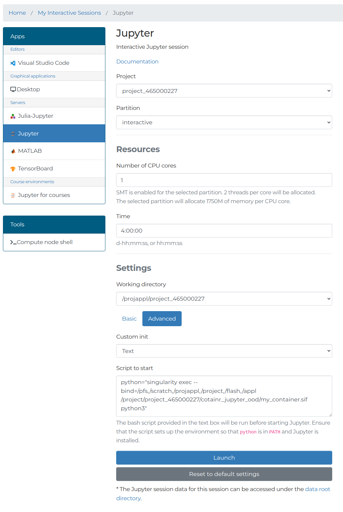

# Cotainr container in LUMI Jupyter web app

- **Keywords:** cotainr, Singularity, Jupyter, OOD
- **Date:** 2024-10-03

An example of using a Singularity container built using [cotainr](https://cotainr.readthedocs.io/en/stable/) with the JupyterLab app provided by the [LUMI web interface](https://www.lumi.csc.fi/public/).

## How to

This is a step-by-step guide to building a container with a custom conda environment on LUMI using cotainr and running the LUMI web interface Jupyter app with the built container on LUMI-C.

### Specify the conda environment

First you must create a [conda environment YAML file](https://conda.io/projects/conda/en/latest/user-guide/tasks/manage-environments.html) specifying the conda/pip packages you want to use. As part of your list of packages, you must include the following:

- jupyterlab >= 3.0.0
- nbclassic

A minimal example of such a conda environment YAML file is [conda_env.yml](conda_env.yml).

### Build the container using cotainr

To build a container based on [conda_env.yml](conda_env.yml) for use with LUMI-C, run the following commands on LUMI:

```bash
module load CrayEnv cotainr
cotainr build my_container.sif --system=lumi-c --conda-env=conda_env.yml
```

To run these commands, you can either [login to LUMI via ssh](https://docs.lumi-supercomputer.eu/firststeps/loggingin/) or use the [shell apps](https://docs.lumi-supercomputer.eu/runjobs/webui/#shell) available once you have [logged in to the LUMI web interface](https://docs.lumi-supercomputer.eu/firststeps/loggingin-webui/).

### Launch Jupyterlab based on the built container

In a browser, log in to the [LUMI web interface](https://www.lumi.csc.fi/public/). Next, choose the `Jupyter` app. Specify project, SLURM partition (e.g. `interactive` for LUMI-C), and resources as usual. Under `Settings`, choose `Advanced` and set `Custom init` to `Text`. In the text box paste the following:

```bash
python="singularity exec --bind=/pfs,/scratch,/projappl,/project,/flash,/appl </path/to/my_container.sif> python3"
```

where you replace `</path/to/my_container.sif>` with the actual full path to the `my_container.sif` container, you have built.

You configuration should look something like this (with `project_465000227` replaced by your project number):


Press the `Launch` button and wait for the interactive session to start. Once it has started, press the `Connect to Jupyter` button, as usual.

Using this approach, the JupyterLab instance is started within the container using the conda environment installed in the container based on [conda_env.yml](conda_env.yml), and with all the LUMI user file systems (/scratch, /project, and /flash) mounted in the container.

Once you have connected to the JupyterLab instance, you can use the [cotainr_LUMI_jupyter_demo.ipynb](cotainr_LUMI_jupyter_demo.ipynb) notebook to verify that you are indeed running in the container, you have built.

## References

More details may be found in:

- [The LUMI web interface docs](https://docs.lumi-supercomputer.eu/runjobs/webui/) and [the LUMI web interface login guide](https://docs.lumi-supercomputer.eu/firststeps/loggingin-webui/)
- [The LUMI Jupyter app docs](https://docs.lumi-supercomputer.eu/runjobs/webui/jupyter/)
- [The LUMI cotainr docs](https://docs.lumi-supercomputer.eu/software/containers/singularity/#building-containers-using-the-cotainr-tool)
- [The official cotainr documentation](https://cotainr.readthedocs.io/en/stable/)
